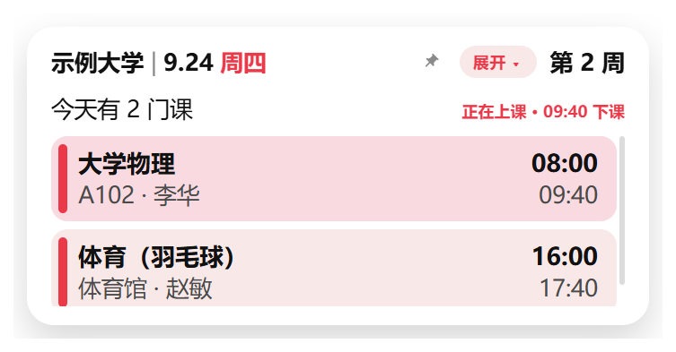
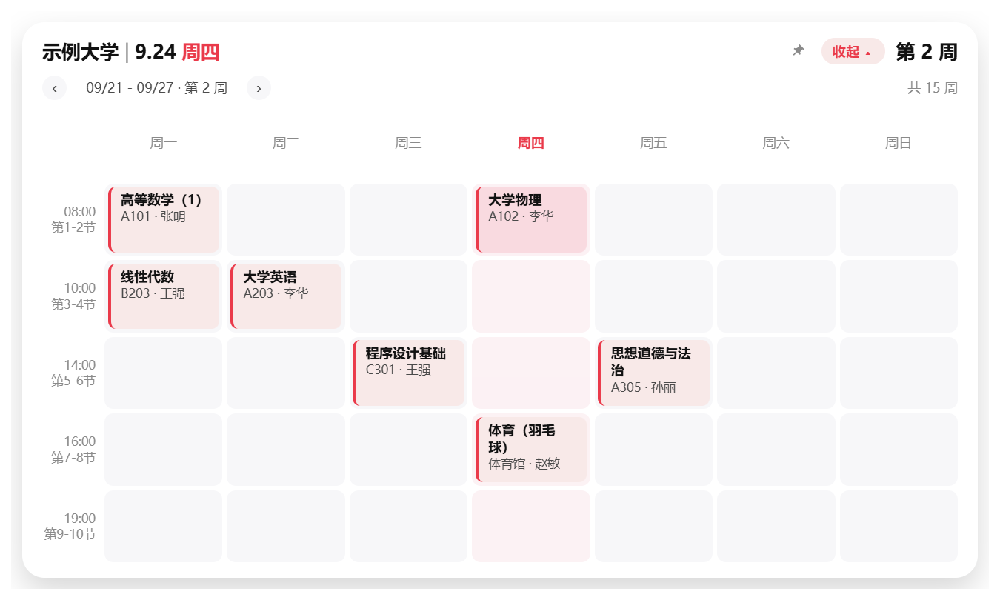

# 课程日程表（Windows 桌面悬浮小组件）

把教务系统导出的 `.ics` 课表变成一张常驻桌面的悬浮卡片：今天/明天上什么课、几点开始、去哪个教室一眼可见，
点开就是整周课表，还能前后翻看其他周。

**版本 1.0.2** ｜ Windows 10 / 11（64 位）｜ Electron + 原生 HTML/CSS/JS ｜ 纯本地、不联网



---

## 一、这个项目解决什么问题

在电脑前学习或工作时，想知道「下一节课在哪、几点开始、在哪个教室」，通常得切到浏览器登录教务系统、
翻好几层页面，或者掏出手机打开课表 App——为了看一眼时间，把手头的事打断了。

这个项目把它变成「瞄一眼桌面边上」：

- **不挡其他应用**：默认待在桌面层（窗口沉在 z 序最底部，紧贴桌面）。你打开浏览器、Word 时它会自动待在下面；
  需要它一直可见时，点一下右上角的小钉子置顶，再点一下放回去。
- **一眼看到关键信息**：今天是第几周、今天/明天有几门课、每门课的上课地点与教师、几点到几点、现在哪节正在上。
- **不用重复操作**：导入一次就记住路径，之后启动自动加载；教务系统重新导出并覆盖同名 `.ics` 后约 0.3 秒自动刷新。
- **私有、离线**：不登录教务系统、不联网、不改动任何云端数据，课表解析与存储全部在本机完成。

不适用的场景：自动抓取教务系统课表（本项目只消费你自己导出的 `.ics`）、手机端、多人共享课表。

---

## 二、主要功能

### 1. 课表导入与解析（iCalendar / `.ics`）

- 导入教务系统或课表工具导出的标准 `.ics` 文件；编码自动识别 **UTF-8(BOM) / UTF-8 / GBK**
- **时区**：优先使用文件内自带的 `VTIMEZONE`；文件里没有时用离线时区数据兜底；`Z` 结尾的 UTC 会换算成本地时间
- **重复规则**完整展开：`RRULE`（每周、`INTERVAL` 隔周、`UNTIL`、`COUNT`、`BYDAY`）、`RDATE`
- **停课与调课**：`EXDATE` 去掉停课的那一次；`RECURRENCE-ID` 覆盖项替换原课（换教室、改时间、改名）
- **其它**：全天事件、跨天事件；缺少 `DTEND` 时按 `DURATION` 或默认 1 小时补齐
- **容错**：同一门课同一时段自动去重；单条事件解析失败只跳过该条并累计告警，不影响整体；
  文件损坏时保留上一次的课表并在底部提示，不会变成空白
- **自动刷新**：监听原 `.ics` 文件，被覆盖后 300ms 防抖重新解析

### 2. 两种视图

| 视图 | 尺寸（白卡） | 内容 |
| --- | --- | --- |
| 今日小卡片（折叠态） | 480 × 240 | 左上 `校名 \| 月.日 周几`、右上 `第 N 周`、`今天有 N 门课`（**今天没课时自动显示「明天有 N 门课」并列出那天的课**）；每门课一行：课程名 + **上课地点 · 教师** + 起止时间；正在上的课高亮并显示「HH:MM 下课」，已结束的课变淡 |
| 周课表（展开态） | 880 × 520 | 周一至周日 × 上课时间行的网格，今天那一列标红，课程块显示课程名与教室/教师；左上角 `‹ ›` **前后翻看其他周**，非本周时出现「回到本周」；没有课的周提示「这周没有课」，开学前/学期结束后显示「未开学 / 假期」 |

### 3. 交互与外观

- 鼠标悬停卡片时底部浮出按钮条：**设置 / 导入 / 退出**；右上角常显 **展开 ▾（收起 ▴）** 与 **小圆形钉子**（置顶开关）
- 按住卡片**顶部两行**拖动移动；拖窗口边缘缩放；位置与尺寸会记住（贴着屏幕边缘展开再收起也会回到原位）
- 不透明度可在 40%–100% 之间调整；主题颜色/字号/圆角集中在 `src/renderer/css/tokens.css`，换肤只改这一个文件

### 4. 系统集成

- **系统托盘**：左键单击显示/隐藏；右键菜单：导入课表、重新载入课表、打开设置、置顶显示、开机自动启动、退出
- **开机自动启动**：设置里一键开关
- 窗口不出现在任务栏（只在桌面悬浮）；卸载不会残留数据

### 5. 设置与数据

- 设置窗口分五组：课表文件、学期、显示、启动、数据（见「四、使用方法」）
- 开学第一周周一可手动指定（点卡片右上角「第 N 周」也能改），或按课表里最早的一节课自动推断；
  周次与「共 N 周」随之变化
- 数据目录 `%APPDATA%\class-calendar\`，每次导入前自动备份上一份，保留最近 5 份

---

## 三、安装方法

### 方式一：安装包（推荐，发给别人用这个）

1. 取 `dist\课程日程表-Setup-<版本号>.exe`（当前已打包的版本可以直接看 `dist` 目录，约 106 MB）
2. 拷到目标电脑，双击运行
3. 如果弹出蓝色的「Windows 已保护你的电脑」：点 **更多信息** → **仍要运行**
   （当前安装包没有代码签名证书，这是正常提示）
4. 安装向导里可以改安装位置；按**当前用户**安装，不需要管理员权限；会自动创建桌面与开始菜单快捷方式

卸载：开始菜单右键「课程日程表」→ 卸载，或「设置 → 应用 → 已安装的应用」里卸载。
卸载**不会删除** `%APPDATA%\class-calendar\`（你的课表与设置），需要彻底清理时手动删除该文件夹。

### 方式二：免安装版

把 `dist\win-unpacked\` 整个文件夹拷走，双击里面的 `课程日程表.exe` 即可使用
（与安装版共用同一份数据目录，只是不写注册表、不建快捷方式）。

### 方式三：从源码运行（开发）

前置条件：Windows 10 / 11（64 位）＋ Node.js 18 以上（开发环境实测 v24.19.0）。

```powershell
npm install     # 安装依赖：Electron、ical.js、@touch4it/ical-timezones、electron-builder 等
npm start       # 启动小组件
```

### 从源码重新打包

```powershell
npm run icon      # 改了主题色后重新生成图标（assets/icon.png + build/icon.ico）
npm run dist      # 生成 NSIS 安装包到 dist\
npm run dist:dir  # 只生成免安装文件夹版 dist\win-unpacked\
```

安装行为写在 `package.json` 的 `build` 字段里：`oneClick: false`（可自选安装目录）、
`perMachine: false`（按当前用户安装）、自动创建桌面与开始菜单快捷方式、
`deleteAppDataOnUninstall: false`（卸载保留数据）。

---

## 四、使用方法

### 第一次：把课表导进来

1. 启动程序，卡片出现在桌面右下角
2. 把鼠标移到卡片上 → 点底部浮出的 **导入** → 选择课表文件（`.ics` 结尾，例如 `课表-示例大学.ics`）
3. 导入后立刻显示今天的课。文件路径会被记住，以后启动自动加载，不用再导

课表文件由教务系统或课表工具导出。要更新课表时，用**同一个文件名**重新导出、覆盖即可（见下面「课表会自动更新」）。

### 日常操作对照表

| 想做什么 | 怎么做 |
| --- | --- |
| 看今天、明天的课 | 卡片默认就显示；**今天没课时自动切换到下一个有课的日子**（标题写「明天有 N 门课」） |
| 看整周课表 | 点右上角 **展开 ▾**；再点 **收起 ▴** 回到小卡片 |
| 看其他周 | 展开后点左上角 **‹ ›** 翻周；点 **回到本周** 一下跳回来 |
| 临时置顶 | 点「展开」左边的小钉子（变红＝已置顶），再点一下取消、回到桌面层 |
| 改开学日期 | 点右上角 `第 N 周` → 选第一周的周一 → **保存**；点 **自动** 恢复按课表推断 |
| 换课表 / 重新载入 | 悬停卡片 → **设置** → 课表文件；或托盘右键 →「导入课表… / 重新载入课表」 |
| 移动与缩放 | 按住卡片**顶部两行**拖动；拖窗口边缘缩放（位置和尺寸会被记住） |
| 当天课程看不全 | 在课程列表上滚轮，卡片内部滚动 |
| 不想看到它 | 托盘右键 →「隐藏组件」；需要时左键单击托盘图标恢复 |
| 退出程序 | 悬停卡片 → **✕**；或托盘右键 →「退出」 |

### 课表会自动更新

教务系统里课表有变动（调课、换教室、停课）时，用**同一个文件名**重新导出，覆盖原来的 `.ics`，
组件会在约 0.3 秒后自动刷新，不需要重启、也不需要重新导入。
如果新文件有问题（导出不完整、格式损坏），组件会保留上一次的课表并在底部提示。

### 设置窗口

入口有三个：悬停卡片的 **设置** 按钮、托盘菜单的「打开设置…」、以及周次面板。

| 分组 | 可以改什么 |
| --- | --- |
| 课表文件 | 当前 `.ics` 路径、选择新文件、重新载入；显示编码、文件大小与导入时间 |
| 学期 | 第一周周一（可点「自动」改回推断）、卡片上显示的校名 |
| 显示 | 是否显示全天事件、只显示含关键词的课程、不透明度（40%–100%）、层级（只放桌面 / 置顶显示） |
| 启动 | 开机自动启动 |
| 数据 | 解析统计（事件条数、展开节数、去重/调课/全天数量）、打开数据目录、清空课表数据 |

改动即时保存，悬浮卡片同步刷新。

### 桌面层与置顶

- **默认（桌面层）**：窗口沉在 z 序最底部、紧贴桌面，其他软件的窗口会盖在它上面，不会挡视线；
  每次失去焦点约 0.4 秒后会自动再沉一次。
- **置顶**：点小钉子或托盘菜单的「置顶显示」，窗口浮在所有窗口之上；再点一下取消。
- 桌面层模式下按 `Win+D` 显示桌面时组件会跟着隐藏（这是 Windows 对普通窗口的正常行为；
  更彻底的「贴壁纸层」没有实现，见「已知限制」）。

### 托盘菜单

程序常驻系统托盘（图标是一张迷你课程卡片）。左键单击 = 显示/隐藏组件，右键 = 菜单：
隐藏/显示、导入课表…、重新载入课表、打开设置…、置顶显示、开机自动启动、退出。

> Windows 11 默认把**新出现的**托盘图标收进任务栏的「^」折叠区。想让它常驻可见：
> 「设置 → 个性化 → 任务栏 → 其他系统托盘图标」里打开「课程日程表」，或直接把图标从折叠区拖到任务栏上。

---

## 五、输入输出示例

### 输入：教务系统导出的 `.ics` 文件

一份课表里，每门课是一个 `VEVENT`，用一条每周重复的 `RRULE` 表示整学期的课。
下面是仓库里 [`samples/课表-示例大学.ics`](samples/课表-示例大学.ics) 的片段（**虚构的示例课表**，
可直接拿来试用本程序）：

```ics
BEGIN:VCALENDAR
VERSION:2.0
PRODID:-//Class Calendar//Example Schedule//CN
BEGIN:VTIMEZONE
TZID:Asia/Shanghai
BEGIN:STANDARD
TZOFFSETFROM:+0800
TZOFFSETTO:+0800
DTSTART:19700101T000000
END:STANDARD
END:VTIMEZONE

BEGIN:VEVENT
UID:sample-math-1
SUMMARY:高等数学（1）
DTSTART;TZID=Asia/Shanghai:20260914T080000
DTEND;TZID=Asia/Shanghai:20260914T094000
RRULE:FREQ=WEEKLY;UNTIL=20261225T160000Z;INTERVAL=1
EXDATE;TZID=Asia/Shanghai:20261005T080000
LOCATION:A101 张明
DESCRIPTION:第1 - 2节\nA101\n张明
END:VEVENT
END:VCALENDAR
```

程序会读这些字段：

| 字段 | 用途 |
| --- | --- |
| `SUMMARY` | 课程名（卡片上显示的标题） |
| `DTSTART` / `DTEND` | 这节课的开始与结束时间（带 `TZID` 时区） |
| `RRULE` | 重复规则：`FREQ=WEEKLY` 每周、`INTERVAL=2` 隔周、`UNTIL` 学期结束 |
| `LOCATION` | 上课地点与教师（如 `A101 张明`，卡片显示为「A101 · 张明」） |
| `DESCRIPTION` | 节次/教室/教师三行（如 `第1 - 2节\nA101\n张明`），补充地点与节次 |
| `EXDATE` | 停课的那一次（如果导出里带） |
| `RECURRENCE-ID` | 调课的那一次（单独一条 VEVENT，覆盖原来的那一节） |

### 输出 1：桌面上的界面



卡片上的文字布局（示例：2026-09-24 周四）：

```
示例大学 | 9.24 周四                       第 2 周
今天有 2 门课                           正在上课 · 09:40 下课
▌ 大学物理                                    08:00
▌ A102 · 李华                                 09:40
▌ 体育（羽毛球）                              16:00
▌ 体育馆 · 赵敏                               17:40
```

### 输出 2：命令行解析结果

不启动界面也能看解析结果，内置了一个检查工具：

```powershell
npm run inspect:ics -- "samples\课表-示例大学.ics"
# 还可以指定日期与条数：--date 2026-09-24 --limit 3
```

拿上面那份课表跑出来的真实输出：

```
文件：samples\课表-示例大学.ics
编码：utf-8（2966 字节）
事件：VEVENT 10 条 -> 展开 113 节课（去重 0，调课覆盖 1，全天 1）
时间范围：2026-09-14T08:00:00 ~ 2026-12-25T14:00:00
学期首周周一：2026-09-14
学期周数：15 周
课程（10 门）：高等数学（1）、线性代数、大学英语、程序设计基础、学术讲座（隔周）、大学物理、体育（羽毛球）、思想道德与法治、高等数学（1）（调课）、校运动会
时区：引用 Asia/Shanghai / 文件内 Asia/Shanghai / 兜底 - / 未解析 -

=== 2026-09-24（第 2 周）===
  08:00-09:40  大学物理  [第1-2节 · A102 · 李华]
  16:00-17:40  体育（羽毛球）  [第7-8节 · 体育馆 · 赵敏]
下一节：体育（羽毛球） 还有 4 小时（09-24 16:00）
```

> 两点说明：
> 1. 工具会打印解析后的绝对路径，上面为便于阅读写成了相对路径。
> 2. 这里的「学期首周周一 / 第 N 周」是按课表里最早一节课**自动推断**的（9/14 → 第 1 周）；
>    卡片上显示的是你在设置里填的开学日期（点卡片右上角「第 N 周」可改），两者一致时周次完全对得上。

### 输出 3：解析后的数据文件

数据与设置都在 `%APPDATA%\class-calendar\`：

| 文件 | 内容 |
| --- | --- |
| `settings.json` | 窗口位置尺寸、折叠状态、不透明度、层级模式、课表路径、校名、开学第一周周一等 |
| `schedule.json` | 解析并展开后的课表（结构见下） |
| `backup\schedule-*.json` | 每次导入前的上一份数据，保留最近 5 份 |

`schedule.json` 的真实结构（截取一条事件）：

```json
{
  "events": [
    {
      "id": "sample-math-1@2026-09-14T08:00:00",
      "uid": "sample-math-1",
      "title": "高等数学（1）",
      "location": "A101 张明",
      "description": "第1 - 2节\nA101\n张明",
      "room": "A101",
      "teacher": "张明",
      "period": "第1-2节",
      "allDay": false,
      "recurring": true,
      "overridden": false,
      "start": "2026-09-14T08:00:00",
      "end": "2026-09-14T09:40:00",
      "startUtc": "2026-09-14T00:00:00.000Z",
      "endUtc": "2026-09-14T01:40:00.000Z"
    }
  ],
  "meta": {
    "sourceEventCount": 10,
    "masterCount": 9,
    "exceptionCount": 1,
    "occurrenceCount": 113,
    "duplicatesRemoved": 0,
    "allDayCount": 1,
    "firstStart": "2026-09-14T08:00:00",
    "lastStart": "2026-12-25T14:00:00",
    "termStartMonday": "2026-09-14",
    "totalWeeks": 15,
    "courses": ["高等数学（1）", "线性代数", "大学英语", "程序设计基础", "学术讲座（隔周）", "大学物理", "体育（羽毛球）", "思想道德与法治", "高等数学（1）（调课）", "校运动会"],
    "timezones": {
      "referenced": ["Asia/Shanghai"],
      "fromFile": ["Asia/Shanghai"],
      "fromFallback": [],
      "unresolved": []
    },
    "truncated": false
  },
  "warnings": [],
  "source": {
    "path": "samples\\课表-示例大学.ics",
    "importedAt": "2026-09-14T01:30:00.000Z",
    "encoding": "utf-8",
    "bytes": 2966
  }
}
```

字段含义：

| 字段 | 说明 |
| --- | --- |
| `id` | `uid@开始时间`；同一门重复课的不同次是不同的 id |
| `room` / `teacher` | 从 `LOCATION` 与 `DESCRIPTION` 里识别出的教室与教师，识别不到时为 `null` |
| `period` | 节次，如 `第3-4节`（同样来自 `DESCRIPTION`） |
| `start` / `end` | 本地墙上时间，卡片与周课表用它显示 |
| `startUtc` / `endUtc` | 同一时刻的 UTC 表示，用于排序与跨时区换算 |
| `recurring` | 是否由重复规则展开而来 |
| `overridden` | 是否是 `RECURRENCE-ID` 调课覆盖出来的那一次 |
| `meta.occurrenceCount` | 展开后的总节课数（示例课表：10 条 VEVENT → 113 节课） |
| `warnings` | 解析时的告警（跳过的事件等），正常为空数组 |

---

## 目录结构

```
src/main/        主进程
  ics.js         .ics 解析、时区处理、重复展开、字段归一化
  schedule.js    周次计算、按天/按周取课、倒计时等纯函数
  main.js        窗口与层级、IPC、导入与自动重载、冒烟自检钩子
  store.js       设置与课表的持久化（含导入前备份）
  tray.js        托盘图标与右键菜单
  win32-layer.ps1  桌面层：把窗口沉到 z 序底部（SetWindowPos HWND_BOTTOM）
src/preload/     contextBridge 暴露给界面的 window.api
src/renderer/    界面层
  index.html · js/widget.js · css/widget.css      小卡片 + 周课表
  settings.html · js/settings.js · css/settings.css   设置窗口
  css/tokens.css  主题变量（颜色/字号/圆角，换肤只改这一个文件）
tests/           node:test 单元测试 20 项（.ics 解析与周次计算）
tools/           开发工具：解析预览、图标生成、单文件说明、文档排版检查、设计图取色
samples/         示例课表（虚构数据），可直接导入试用
docs/            使用说明（md + html）与界面截图
assets/          托盘与窗口图标      build/   安装包图标（.ico）
```

## 开发命令

| 命令 | 作用 |
| --- | --- |
| `npm start` | 以开发模式启动小组件 |
| `npm test` | 运行单元测试（20 项，基于 node:test） |
| `npm run inspect:ics -- "<文件>"` | 命令行查看某个 `.ics` 的解析与展开结果 |
| `npm run icon` | 重新生成图标（`assets/icon.png` 与 `build/icon.ico`） |
| `npm run dist` | 打包 NSIS 安装包到 `dist\` |
| `npm run dist:dir` | 只生成免安装版 `dist\win-unpacked\` |
| `node tools/make-usage-doc.js` | 生成单文件版使用说明 `dist\使用说明.html` |

调试用环境变量（不用真改系统时间，也能看任意日期的界面）：

| 变量 | 作用 |
| --- | --- |
| `CLASS_CALENDAR_ICS` | 启动时直接导入指定 `.ics` |
| `CLASS_CALENDAR_NOW` | 固定「当前时间」，例如 `2026-09-24T09:00:00` |
| `CLASS_CALENDAR_VIEW` | `compact` / `expanded`，指定启动时的视图 |
| `CLASS_CALENDAR_SMOKE=1` | 启动后打印界面文本与自检结果，然后自动退出 |
| `CLASS_CALENDAR_SHOT` / `CLASS_CALENDAR_SETTINGS_SHOT` | 冒烟模式下把卡片 / 设置窗口截图保存到指定路径 |
| `CLASS_CALENDAR_DATA_DIR` | 指定另一个数据目录（配合示例课表做截图/演示，不会动到真实课表） |

```powershell
$env:CLASS_CALENDAR_SMOKE='1'; $env:CLASS_CALENDAR_NOW='2026-09-24T09:00:00'
$env:CLASS_CALENDAR_ICS='samples\课表-示例大学.ics'
& 'node_modules\electron\dist\electron.exe' .
```

主题设计图取色（换了设计稿时先用它量颜色）：

```powershell
powershell -NoProfile -ExecutionPolicy Bypass -File tools\extract-palette.ps1 -Path "设计图.png" -Top 12
```

## 文档索引

| 文件 | 说明 |
| --- | --- |
| [CHANGELOG.md](CHANGELOG.md) | 更新日志：每次改动一条，标明版本号 |
| [docs/使用说明.md](docs/使用说明.md) · [docs/使用说明.html](docs/使用说明.html) | 面向使用者的说明（含截图，HTML 可直接 Ctrl+P 存成 PDF） |
| `dist\使用说明.html` | 单文件版（图片内嵌），随安装包一起分发 |
| [samples/课表-示例大学.ics](samples/课表-示例大学.ics) | 虚构的示例课表，用来试用或做输入输出演示 |

## 已知限制

- **安装包未做代码签名**：在别人的电脑上首次运行会弹 SmartScreen 提示，需要点「更多信息 → 仍要运行」；
  彻底消除要购买代码签名证书，并在 `build.win` 里配置证书。
- **不抓取教务系统**：只能导入你自己导出的 `.ics`。登录、验证码、校内网访问都不处理。
- **桌面层不是壁纸层**：现在是把窗口沉到 z 序底部，按 `Win+D` 显示桌面时组件会跟着隐藏；
  真正的「贴壁纸层（WorkerW）」没有实现。
- **教室/教师识别依赖导出格式**：程序按「节次 / 教室 / 教师」三行的习惯解析 `DESCRIPTION`，
  不同学校导出的格式差异较大；识别不到的部分留空，不会显示错误内容。
- **同一时间只有一份课表**：重新导入会整体替换当前课表，旧数据会自动备份到 `backup\`。

---

## 许可证

[MIT License](LICENSE) © 2026 hu-516

可以自由使用、修改、分发（含商用），只需保留版权与许可声明；软件按「原样」提供，不附带任何担保。
