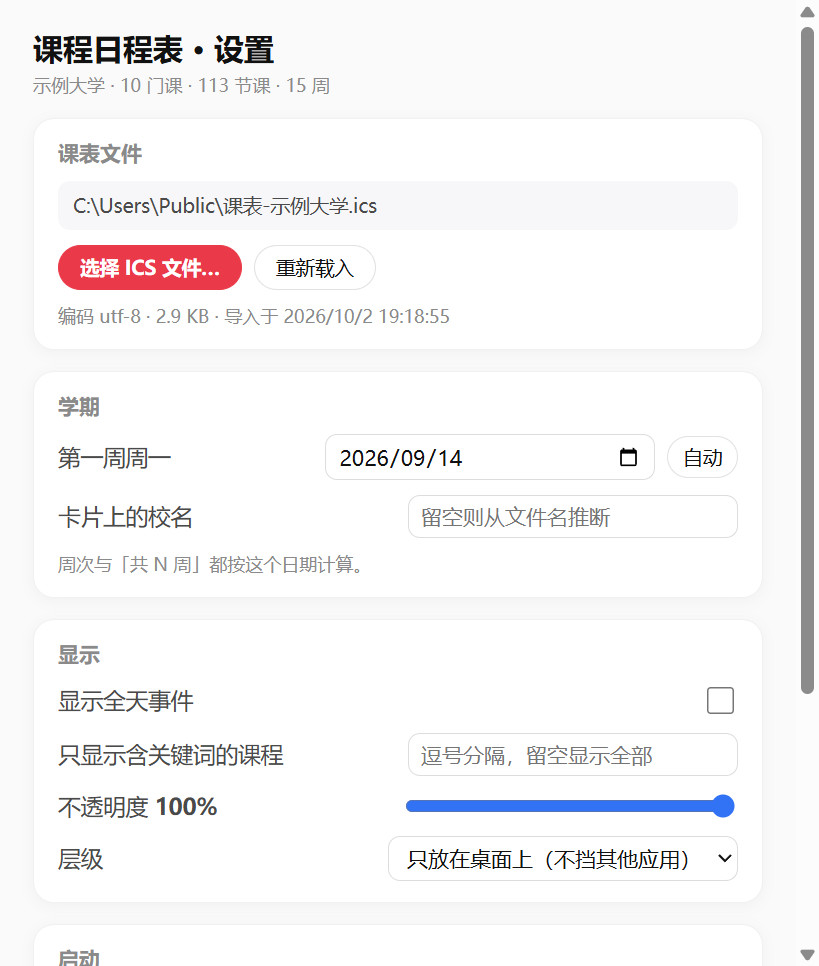

# 课程日程表 · 使用说明

一个悬浮在 Windows 桌面上的课程表小组件：导入教务系统的课表文件后，随时能看到今天有什么课、
下一节几点开始，也可以展开看整周课表。它默认待在桌面层，不会挡在别的软件上面。

版本 1.0.2 ｜ 适用于 Windows 10 / 11（64 位）

---

## 一、安装

1. 把安装包 `课程日程表-Setup-1.0.2.exe` 拷到目标电脑（U 盘、网盘、微信都行）。
2. 双击运行。如果弹出蓝色的「Windows 已保护你的电脑」提示：
   点 **更多信息** → **仍要运行**（安装包没有购买代码签名证书，属正常提示）。
3. 安装向导里可以改安装位置，也可以直接用默认位置。点「安装」。
4. 装完会自动创建**桌面快捷方式**和**开始菜单项**。安装不需要管理员权限。

想卸载：开始菜单搜索「课程日程表」→ 卸载；或「设置 → 应用 → 已安装的应用」里卸载。
卸载**不会删除你的课表和设置**，重新安装后还在（见第八节）。

---

## 二、第一次使用：把课表导进来

1. 启动程序，卡片会出现在桌面右下角。把鼠标移到卡片上，底部会浮出一排按钮。
2. 点 **导入**，选择课表文件（`.ics` 结尾，例如 `课表-示例大学.ics`）。
3. 导入成功后卡片立刻显示今天的课。程序会记住这个文件的位置，以后开机自动加载，不用再导。

课表文件从哪来？由教务系统或课表工具导出。需要更新课表时，用**同一个文件名**重新导出并覆盖
原来的文件即可（见第六节）。

---

## 三、界面说明


| 位置 | 含义 |
| --- | --- |
| 左上 `示例大学 \| 9.24 周四` | 校名、日期、星期（星期为红色） |
| 右上 `第 4 周` | 当前是学期第几周，**点它可以修改开学日期** |
| `今天有 4 门课` | 当天课程数量；**今天没课时会自动显示「明天有 N 门课」并列出那天的课** |
| 粉色课程条 | 课程名（加粗），下面一行是**上课地点 · 教师**（例如 `A101 · 张明`），右侧开始与结束时间 |
| 红色小字 `正在上课 · 09:45 下课` | 当前正在上的课，该行底色会加深 |
| 已结束的课 | 整行变淡 |

---

## 四、常用操作

### 展开完整周课表

点右上角的 **展开 ▾** 按钮，卡片会变成整周课表（周一至周日 × 上课时间），今天那一列标红。
再点 **收起 ▴** 回到小卡片。


### 查看其他周的日程

周课表左上角有翻页按钮：点 **‹** 看上一周，点 **›** 看下一周，中间的
`09/21 - 09/27 · 第 4 周` 会跟着变（开学前显示「未开学」，学期结束后显示「假期」）。
翻到别的周时右边会出现 **回到本周** 按钮，点一下立刻跳回本周；只有本周才把当天那一列标红。

### 需要时置顶

默认情况下，组件待在桌面层，**不会挡住其他软件**——你打开浏览器、Word，它会自动躲到后面。
需要它一直浮在最上面时，点「展开」左边那枚**小钉子**：钉子变红表示已置顶，再点一下取消。

### 移动和缩放

- 移动：按住卡片**顶部两行**（校名那一行、「今天有 N 门课」那一行）拖动。
- 缩放：拖动窗口边缘。位置和大小会被记住，下次启动还在原处。

### 修改开学日期

点右上角的 `第 N 周` → 选择第一周的周一日期 → 点「保存」。周次、周课表表头都会跟着变。
点「自动」则改回按课表里最早的一节课自动推断。

### 打开设置

鼠标移到卡片上 → 点 **设置**；或者右键任务栏里的程序图标 →「打开设置…」。



可设置的内容：

| 分组 | 能改什么 |
| --- | --- |
| 课表文件 | 换一个课表文件、重新载入；显示当前文件路径、编码和导入时间 |
| 学期 | 第一周周一、卡片上显示的校名 |
| 显示 | 是否显示全天事件、只显示含关键词的课程、不透明度（40%–100%）、是否置顶 |
| 启动 | 开机自动启动 |
| 数据 | 查看解析统计、打开数据目录、清空课表数据 |

改动即时生效，卡片会同步刷新。

### 托盘菜单

程序常驻系统托盘（图标是一张迷你课程卡片）。左键单击 = 显示/隐藏卡片，右键 = 菜单：
隐藏/显示、导入课表、重新载入课表、打开设置、置顶显示、开机自动启动、退出。

> 如果任务栏右下角看不到图标，是 Windows 11 的默认行为：新图标会被收进「^」折叠区。
> 想让它常驻显示，打开「设置 → 个性化 → 任务栏 → 其他系统托盘图标」，把「课程日程表」打开；
> 或者直接从折叠区把图标拖到任务栏上。

---

## 五、课表会自动更新

教务系统里课表有变动（调课、换教室）时，用**同一个文件名**重新导出，覆盖掉原来的 `.ics` 文件，
组件会在约 0.3 秒后自动刷新，不需要重启，也不需要重新导入。

如果新文件有问题（导出不完整、格式损坏），组件会保留上一次的课表并在底部提示，不会变成空白。
也可以手动刷新：设置窗口里的「重新载入」，或托盘菜单的「重新载入课表」。

---

## 六、数据在哪里、怎么备份

所有设置与解析后的课表都在：

```
%APPDATA%\class-calendar\
```

（在资源管理器地址栏粘贴这行回车即可打开，或用设置窗口的「打开数据目录」按钮。）

| 文件 | 内容 |
| --- | --- |
| `settings.json` | 窗口位置大小、开学日期、校名、不透明度、是否置顶、开机自启等 |
| `schedule.json` | 解析后的课表数据 |
| `backup\` | 每次导入前的上一份课表（保留最近 5 份） |

换电脑或重装系统前，把整个 `class-calendar` 文件夹拷走即可；在新电脑上装好程序、退出程序后，
把文件夹放回同样位置就恢复原状。不过课表本身建议直接留着 `.ics` 文件重新导入一次，更干净。

---

## 七、常见问题

**任务栏里找不到程序图标？**
这是设计如此——组件只在桌面悬浮，不占用任务栏。请从桌面、开始菜单或系统托盘打开；
如果托盘图标被折叠了，见第四节的说明。

**周次显示不对（例如显示「未开学」）？**
点右上角 `第 N 周`，把第一周周一改成你校历上的日期，点保存。

**今天没课，为什么显示的是明天的课？**
这是故意设计的：今天没课时自动展示下一个有课的日子，标题会写明「明天有 N 门课」。

**某节课没显示出来？**
检查三点：① 设置里「只显示含关键词的课程」是否填了内容；② 该课是否为全天事件且关闭了
「显示全天事件」；③ 课表文件里是否真的包含这节课（可以在设置窗口看解析统计的节数）。

**教室或教师显示不全 / 显示成别的内容？**
不同教务系统导出的字段格式不同，程序会尽量从描述的「节次 / 教室 / 教师」三行里识别。
遇到识别不了的课，它只显示能识别到的部分，不会显示错误内容。

**想看下周、下下周的课？**
展开成周课表后，用左上角的 **‹ ›** 翻页；点「回到本周」随时跳回本周。

**卡片上显示的地点不对？**
地点取自课表文件的 `LOCATION` 字段（也就是教务系统导出的教室）。如果导出文件里教室为空，
这里就只显示教师；重新导出一次课表即可更新。

**课表文件被删了或挪走了？**
程序会提示读取失败并继续用上一次的数据。重新导入一次新位置的 `.ics` 即可。

**开机没有自动启动？**
在设置窗口勾选「开机自动启动」。若之前勾过又移动过程序位置，重新勾一次即可。

**想临时让开桌面看壁纸？**
托盘菜单点「隐藏组件」，需要时再点「显示组件」。

---

## 八、卸载

开始菜单 → 右键「课程日程表」→ 卸载，或「设置 → 应用 → 已安装的应用」里卸载。
卸载不会删除 `%APPDATA%\class-calendar`（你的课表与设置），需要彻底清理时手动删除该文件夹。
